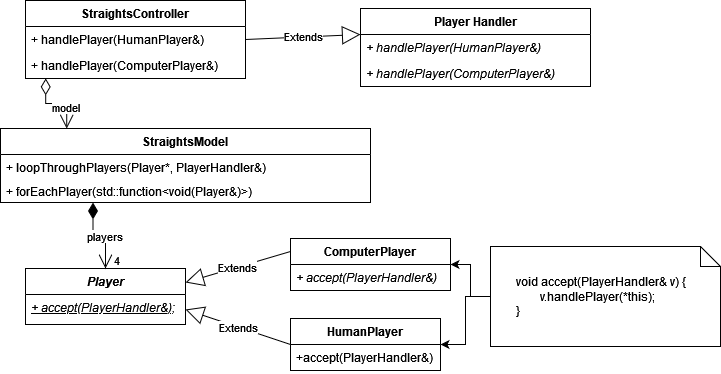

# Design Document

## Overview

The design of the Straights game uses the Model-View-Controller architecture as a baseline. The View is an abstract class that handles how information is displayed and gathered from the user. It is implemented as a child class called "TextView," which uses `stdin` and `stdout` create a UI. The Model holds all the game state information, and provides methods to interact with the it. The controller holds the View and Model as fields, and acts as a bridge between user I/O and the game state. It implements all the game and round logic, and is started by using the `startGameLoop()` method.

The Model holds 4 Players, and a Deck. The deck is composed of several Cards, which can be given and taken from a Player using its public methods. The Player class is an abstract class that keeps track of their hand, their discards, and their scores. It has two subclasses: HumanPlayer and ComputerPlayer, which are meant to represent a human player which must interact with the View to make decisions, and an AI player which takes turns automatically. The ComputerPlayer uses the Strategy design pattern to implement its AI behaviour.

The Controller is also a subclass of the abstract PlayerHandler class, which is meant as an implementation of the Visitor design pattern. The Model contains the method `loopThroughPlayers` which takes a PlayerHandler as an argument, and loops through each player calling `player.accept(*this)` on each one. This way, ComputerPlayers and HumanPlayers can share a single method to start their turn, but they can both be implemented differently. This is the core of the game loop implementation.

## Design

The MVC archutecture is baseline to the project, but this naturally creates some encapsulation issues. The first of which being: "How can the Controller interact with the Model to loop through Players?" In theory, the model should be able to change its internal implementation at any moment while keeping the Controller uneffected, but we also want to encapsulate the game logic within the Controller to keep cohesion high. My first solution to this problem was a `loopThroughPlayers()` method in the Model that took a function lambda as a parameter. The Model would then loop through each player, and apply the lambda function to each. This would've worked fine if there was only one type of player, but the problem arises when we have a HumanPlayer and a ComputerPlayer which need to be treated seperately on each turn. The second solution to this was to employ the Visitor design pattern. The Controller is a subclass of the abstract PlayerHandler class, which has a virtual `handlePlayer` method for both a ComputerPlayer and a HumanPlayer. Then, each player type has a corresponding `accept` method which takes the PlayerHandler as an argument, and calls its correspondng `handlePlayer` method.

The old solution was kept in the form of the `forEachPlayer` function, which applies a function lambda to each player in the Model. This proved useful in some cases.

In all honesty, there might be better solutions to this problem, which is tackled in the Final Questions section.

Another problem was how to elegantly implement different AI behaviours for a ComputerPlayer. To solve this, I used the Strategy design pattern on the ComputerPlayer. Each AI player has an instance of the abstract TurnStrategy class, and when a ComputerPlayer is called to do their turn, the TurnStrategy's virtual `doTurn` method is called, which would be implemented differently for different subclasses.

While I wanted the Controller to handle the bulk of the game logic, I made sure that each class enforced its own invariants well. For example, the Card class doesn't store its ranks and suits as integers, but rather as enumerated classes called Rank and Suit. This way, any integer outside the enumerated class is automatically detected as being invalid. Constants for each suit and value are also provided in the header files to make initializing cards easier. As well as this, I made many custom error classes to explicitly tell the client if an invariant is ever broken for some reason. This made debugging and improving the classes much easier.

## Resilience to Change

The program's reslisience to change mostly boils down to one, each class having exactly one purpose, two, those classes being very encapsulated, and three, many features being abstracted out is a versatile way.

First, each class having only one purpose means that changes to the code base are very targeted. That is, to change some specific functionality, often you will only have to change a single class. To change anything related to cards, the `deck.cc` file will most likely be the only thing you touch.

Also, there is not one occurence in the program where a class must access the internal working of another. This means the implementation of any class can be changed significantly without worrying about how those changes might ripple out into other parts of the code. This, combined with the first point means that changes to the code base are very precise. Now, we combine this with the third element.

All the public methods I were designed to be very loosely coupled to the implemetation, and moreso coupled to the idea the class was meant to represent. The example I give answering the 3rd question in this document is the View class, which because of its abstraction being very loosely coupled to the implementation of the game, it can be implemented in a myriad of ways. A more specific example is a decision I made mid-way through development to remove the `Player` class's ability to "play a card." This is because this couples the player to the game board (What does it mean to play a card when only the player exists? Where is it played?). It then made more sense to rename this method to `removeCard`, which simply removes a card from the players hand. This way, the Controller class can then handle how that removed card acts with the game board, to keep the logic encapsulated in that Controller class.

These three elements together meant that any change to the codebase is extremely targeted (i.e., only one or two methods will change), and the rest of the implementation isn't affected much.

## Answers to Questions

**Consider that different types of computer players might also have differing play strategies, and that strategies might change as the game progresses i.e. dynamically during the play of the game. How would that affect your class structures?**

This would affect my class structures very little. I used a Strategy design pattern to implement AI behaviour, which is completely decoupled from the Model and Controller classes. This way, an AI player's TurnStrategy can be switched out for another one at any time without consequence to other classes. I would only need to add public methods for initiating this change.

**How would your design change, if at all, if the two Jokers in a deck were added to the game as wildcards i.e. the player in possession of a Joker could choose it to take the place of any card in the game except the 7S?**

Since I am using enumerated classes to represent Ranks and Suits, I would only need to add a `JOKER` value to these classes. Then, the Card class's invariants are still preserved. Then, the Model's `isLegalPlay` method would have to be slightly changed to accomodate the new rule. This is it, since the classes were designed to have very low coupling with eachother.

**What sort of class design or design pattern should you use to structure your game classes so that changing the user interface from text-based to graphical, or changing the game rules, would have as little impact on the code as possible? Explain how your classes fit this framework.**

Most of the game rules and game logic are implemented in the Controller class. Since the view and model are very encapsulated, the Controller can change independently of them; that is, the rules of the game can be easily modified in this class without worrying how it might affect other classes.

Also, to implement the View class I could've simply coded public methods to receive text input, and to display text input to the user. Instead, I abstracted out the functionaity of the View, and gave its public methods more specific functionality within the context of the game. For example, instead of one massive command that gets text input from the user, that was abstracted out into a method that prompts the user to input a command, and a method that prompts the user for a card selection. This way, the implementation of the abstract View class is not tied to any specific implementation, since all its methods make sense outside of the implementation.

## Final Questions

**What lessons did you learn about writing large programs?**

This project really gave be an appreciation for architecture design. When all your classes are seperated out with very high encapsulation, it makes the client's programming experience so much more smooth. I'd imagine in a large program, having to worry about every class's quirks and invariants would be nighmarish. As well as this, with every class being encapsulated, I can change the internal workings of a class on the fly without having to worry about how the change might affect different parts of the program. It makes debugging much easier, since you can narrow down errors to the objects they originated from. In a large project, being able to narrow down errors fast would no doubt be a massive time save.

However, I noticed how hasty design decisions you make in the moment can snowball into frustration later on if you're not careful. By the nature of creating classes, you are creating restrictions on how a client can interact with your program. This can be a good thing if you want to preserve invariants and to encapsulate, but if your design decisions are bad, then it creates a lack of functionality. That lack of functionality then requires awkward work-arounds, which then spawn more awkward work-arounds. If you're not careful, one bad design decision can lead to a program full of spaghetti code. In a large program, those first few high-level design decisions are then absolutely key to how smooth the developer experience will be.

As well as this, documentation proved key. If I had to onboard a new developer onto this project, it makes it so easy that I have a UML diagram I could show them, explain the design patterns used, and they can always jump into the header files to see the documentation of each class's public methods.

**What would you have done differently if you had the chance to start over?**

Looking back, I noticed many of my design solutions tackled only one problem. Because of this, I have many disjunct solutions to different problems, which could've all been tackled with one, more elegant solution. Specifically, I am using the Visitor design pattern to treat Human and Computer players differently, I have a `forEachPlayer` method in the model which applies a function lambda to each player, and I am using the Strategy design pattern to implement different AI behaviours. I feel like all these different solutions make for a very convoluted class structure. I'm imagining if I were working in a large group of people, documenting all these different solutions and onboarding new developers would be a nightmare. Perhaps I could've solved all of this with one elegant use of the Visitor design pattern.

Specifically, using the Strategy design pattern to control AI behaviour created many unforseen issues. The `handlePlayer` method calls the ComputerPlayer's `doTurn` method, which calls its turnStrategy's `doTurn` method. So then, how is the ComputerPlayer supposed to interact with the Model and the View? Because I was too far in the project, there was no elegant solution to this problem without major refactoring, so a reference to the View and Model is kept in each TurnStrategy. This is highly inelegant, and I would redesign this aspect heavily if given another chance.

I also feel like in several places, coupling is quite high. Particularly, the View takes parameters such as `vectors` and `deques` which are directly linked to the implementation of Model. If I were ever to change how cards and piles were stored, I'd also have to change the entirety of the View, which is bad design. Perhaps I could solve this using better use of Visitors, or by using function lambdas more, i.e. giving the Player class a `forEachCard` which applies a function to every card in their hand. Basically, I would try to eliminate all accessor methods which return a container class.
